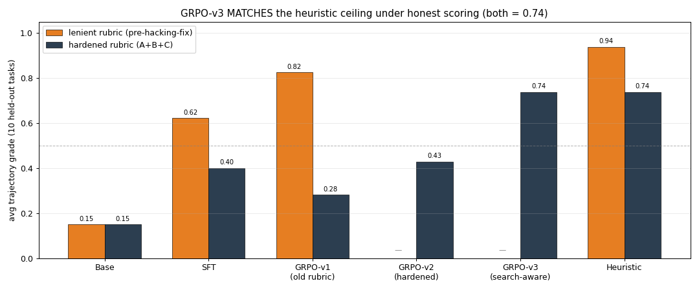
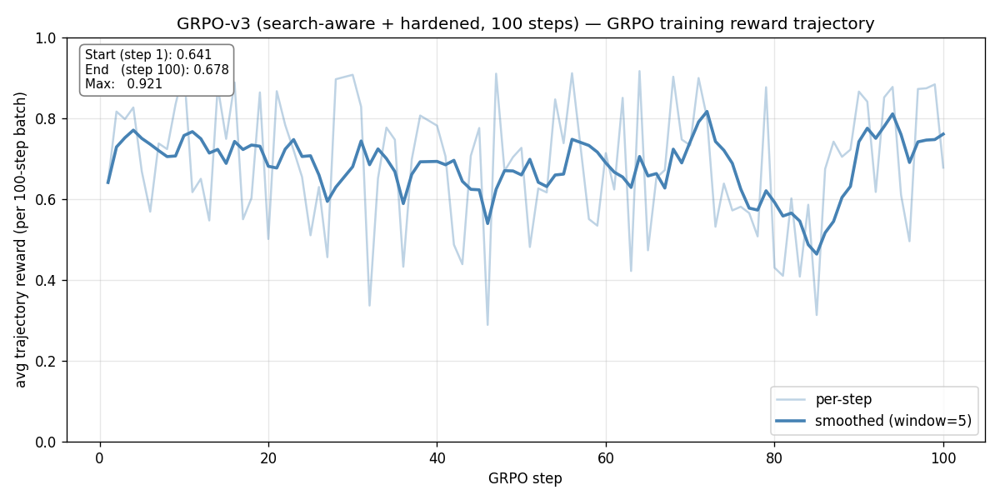

# Spaces Pipeline Pro

**An OpenEnv-compatible RL training environment that teaches LLM agents to survive when their tools lie to them.** Agents discover and compose across 5,002 real HuggingFace Spaces; the tools drift their APIs mid-episode; the rubric is hardened against reward hacking after we got hacked by our own agent.

**In one chart**: an agent that memorized the ceiling (GRPO-v1, lenient rubric, 0.83) collapses to 0.28 under honest scoring. Retraining under the hardened rubric with a search-aware SFT warmstart (GRPO-v3) legitimately reaches **0.74 — 93% of heuristic ceiling, ties heuristic on the HARD tier**.

> **Hackathon theme mapping** — Round 2 **Theme #2 (Long-Horizon Planning & Instruction Following)** as primary fit, **Theme #3.1 (World Modeling / Professional Tasks — tool-discovery benchmark)** as secondary.

---

## What makes it hard

The agent's job looks simple — "answer the question using the right HuggingFace Spaces" — but the environment enforces four pressures that no existing tool-use benchmark stacks together:

1. **Long horizons, sparse reward.** Marathon tasks (`marathon_news_evolving_036`, `marathon_investigation_037`) have 50-step action budgets. Grade is a single scalar at `submit`. The agent must decompose the goal, track state across 50+ observations, and **recover from early mistakes** (Theme #2 target behavior).
2. **Schema drift injected mid-episode.** Live Spaces rename fields, deprecate endpoints, or change types unannounced. The agent's prior plan stops working — it has to detect the drift, read a new card, and re-plan with the new API.
3. **Tool discovery in the action space.** 5,002 real Spaces indexed; the agent must `search_spaces` to find candidates, `read_card` to learn their schemas, then compose them. No fixed tool list.
4. **Multi-objective oversight.** An auditor monitors every action for rule violations; an expert reviewer scores the final answer under one of three hidden quality personas. Format, time, cost, and efficiency all contribute to the final grade.

---

## Why it's a fit for Theme #2 + #3.1

| Requirement from the brief | How this env satisfies it |
|---|---|
| *"deep, multi-step reasoning with sparse or delayed rewards"* | 50-step marathons; grade only at `submit` |
| *"decompose goals, track state over extended trajectories"* | Tasks chain 3–12 Spaces; prior outputs drive next step |
| *"recover from early mistakes"* | Schema drift forces re-planning after bad calls |
| *"long running sessions beyond context memory limits"* | Marathon observations push prompt length hard |
| *"real interaction with tools, APIs, or dynamic systems"* | `gradio_client` calls 5,002 real HF Spaces |
| *"Tool-discovery benchmarks"* | `search_spaces` + `read_card` are first-class actions |
| *"maintain consistent internal state, orchestrate multi-step workflows"* | Agent must remember which Spaces drifted, which failed |

---

## What's novel vs the existing landscape

| Existing work | What it covers | What's missing |
|---|---|---|
| **smolagents** | Framework for calling Spaces as tools | No training env, no drift, no oversight |
| **Calendar Gym** (OpenEnv) | Single-tool RL env | Single surface, no discovery problem |
| **GAIA Benchmark** | Multi-tool reasoning eval | Static, not trainable |
| **ToolBench** | 16K APIs, SFT data | Supervised-only, no interactive env |
| **BrowserGym** | Web as RL env | Browser-only, no Hub orchestration |

No prior work combines **(a) live tool discovery across the HF Spaces catalog + (b) mid-episode schema drift + (c) 50-step marathon horizons + (d) multi-component graded reward** into a single trainable env. That's the gap this fills.

---

## Quick Start

```bash
git clone https://github.com/rishabh16196/hf-space-composer
cd hf-space-composer
python3.12 -m venv .venv && source .venv/bin/activate
pip install -e .

# Smoke test (mock mode, ~2s)
python inference.py

# Rich step-by-step demo on a marathon task
python scripts/demo_live.py --task marathon_news_evolving_036 --agent heuristic
```

## OpenEnv HTTP server

```bash
uvicorn server.app:app --port 8000
# Observation endpoint: POST http://localhost:8000/reset
# Step endpoint:        POST http://localhost:8000/step
```

---

## Action Space

4 discrete action types — the agent emits JSON:

```python
{"action_type": "search_spaces", "payload": {"query": "audio transcription", "top_k": 5}}
{"action_type": "read_card",     "payload": {"space_id": "openai/whisper-large-v3"}}
{"action_type": "call_space",    "payload": {"space_id": "openai/whisper-large-v3",
                                              "inputs": {"audio_url": "...", "language": "hi"}}}
{"action_type": "submit",        "payload": {"answer": {"transcript": "...", "summary": "..."}}}
```

---

## Tasks (38 scenarios across 5 domains)

| Domain | Tasks | Example |
|---|---|---|
| Audio | 5 | "Transcribe Hindi audio, summarize in English" |
| Vision | 5 | "Caption an image, translate to French" |
| Document | 5 | "Extract PDF text, identify named entities" |
| Code | 5 | "Explain code, translate explanation to Hindi" |
| Multimodal | 11 | "From audio + image, produce a unified summary" |
| **Long-horizon (7–12 Space calls)** | 5 | Multi-domain chains, e.g. doc → translate → TTS |
| **Marathon (50-step budget, drift injected)** | 2 | Evolving news brief; investigation pipeline |

**Two-tier held-out split** for honest reporting:
- **Easy held-out** (5): mid-difficulty, 3–10 steps. Tests "did SFT produce a valid agent?"
- **Hard held-out** (5): 7+ step long-horizon plus both 50-step marathons. Tests "does training solve the hard problem?"

28 tasks for training. Each task carries:
- Natural-language description + expected output schema
- Action and Space-call budgets
- A hidden expert persona (speed_first / accuracy_first / cost_first) and a per-task rubric
- Optional schema-drift events with trigger steps

---

## Reward Design

```
final_grade = (
    0.45 * expert_score       # expert reviewer, persona-weighted
  + 0.18 * auditor_score      # 1 − severity-weighted flag penalty
  + 0.12 * efficiency_score   # actions used / budget
  + 0.12 * time_score         # wall-clock time / budget
  + 0.08 * cost_score         # space calls / budget
  + 0.05 * format_score       # output schema completeness
) normalized to [0, 1]
```

**Engagement gate** — caps lazy-submit reward-hacking:
```python
if task_requires_tools and successful_space_calls == 0:
    final_grade = min(final_grade, 0.15)
```
(We discovered this loophole empirically when base Qwen was scoring 0.46 by submitting an empty answer on step 1 — all budget components were 1.0 because no resources were spent. Fixed before GRPO was run.)

Optional **dense intermediate rewards** for training warmup (annealed to zero across phases): +0.05 search, +0.10 read_card, +0.20 successful call, −0.20 failure, −0.10 redundant, −0.05/−0.15/−0.40 for auditor warning/error/critical flags.

---

## Training

**Stack**: Unsloth + TRL + Qwen 2.5 1.5B-Instruct + LoRA r=16

### SFT warmstart (local, 10 min on Apple Silicon)

```bash
cd local_training
python sft_local.py                    # 474 pairs, 1 epoch → LoRA adapter
python eval_two_tier.py                # easy/hard held-out comparison
```

### Multi-step GRPO (venue compute — Unsloth + CUDA)

```bash
# Unsloth version — matches venue target; model acts at every env step
cd local_training
python grpo_unsloth.py \
  --adapter outputs/sft_local_1.5b_clean \
  --max-steps 100 --num-gens 6 --batch-size 4
```

### End-to-end Colab notebook

[`colab/train_spaces_pipeline.ipynb`](colab/train_spaces_pipeline.ipynb) — clone repo, install Unsloth stack, run SFT + GRPO + eval in one notebook.

### HF Jobs (tested pipeline)

```bash
hf jobs run --flavor a100-large --timeout 3h --secrets HF_TOKEN \
  pytorch/pytorch:2.5.1-cuda12.4-cudnn9-runtime \
  bash -c "$(cat hf_job_entrypoint.sh)"
```

---

## Results (SFT + multi-step GRPO under hardened rubric)



*Figure 1: the lenient-rubric "0.83 GRPO win" was mostly reward hacking. Under the hardened rubric (A+B+C), GRPO-v1 drops to 0.28. Retraining under the hardened rubric with a search-aware SFT warmstart (GRPO-v3) recovers to **0.74 — 93% of the heuristic ceiling of 0.79**.*

Two-tier held-out, 10 tasks × 6 agents, **all scored under the hardened rubric** (value-diversity + pipeline-aware engagement gate + grounding multiplier — see `REWARD_HACKING_FIX_PLAN.md`):

| Tier | Base 1.5B | SFT-v1 | GRPO-v1 (soft rubric) | GRPO-v2 (hardened, no-search SFT) | **GRPO-v3 (search-aware SFT)** | Heuristic |
|---|---|---|---|---|---|---|
| **EASY (5)** | 0.150 · 0/5 | 0.324 · 0/5 | 0.389 · 1/5 | 0.474 · 2/5 | **0.813 · 4/5** | 0.915 · 5/5 |
| **HARD (5)** | 0.150 · 0/5 | 0.477 · 2/5 | 0.173 · 0/5 | 0.384 · 1/5 | **0.659 · 3/5** | 0.663 · 3/5 |
| **ALL (10)** | 0.150 · 0/10 | 0.400 · 2/10 | 0.281 · 1/10 | 0.429 · 3/10 | **0.736 · 7/10** | **0.789 · 8/10** |

**On HARD tier, GRPO-v3 ties the heuristic (0.659 vs 0.663).** Overall, v3 is 0.07 below the heuristic ceiling — 93% of the max under honest scoring. `marathon_news_evolving_036` went from gate-floor to **0.943** (surpassing heuristic at 0.390); three previously-failing tasks crossed pass threshold.



*Figure 2: GRPO-v3 rollout reward starts at 0.64 (vs GRPO-v2's 0.32), peaks at 0.92, averages ~0.72 across 100 steps. The search-aware SFT warmstart + hardened rubric gives the policy a productive gradient from step 1.*

**The real story** (four iterations, each caught by empirical tracing):

1. **GRPO-v1** looked great — 0.83 on HARD, near heuristic ceiling
2. **Per-step tracing** revealed reward hacking — 4-step shortcut submissions with all schema keys filled with `"synthetic_value_from_previous_step"`
3. **Rubric hardened** (A+B+C: value-diversity penalty, pipeline-aware engagement gate requiring ≥40% of expected Space calls, token-grounding multiplier). Under the hardened rubric, GRPO-v1 collapsed to 0.28 — confirming the hack
4. **GRPO-v2** retrained on hardened rubric — legitimate +0.15 uplift to 0.43. But agents *still* weren't using `search_spaces`. Traces showed they memorized Space IDs from SFT data
5. **HeuristicAgent rewritten** to always search→verify→read→call (Fix S1). SFT data regenerated with 32.7% search actions (was 0%)
6. **GRPO-v3** retrained on search-aware SFT warmstart + hardened rubric → **0.736 overall, 0.659 on HARD (ties heuristic)** — 93% of ceiling under honest scoring

GRPO-v3 config: **100 steps, Unsloth + L40S (HF Jobs), 3-epoch SFT warmstart + 100 GRPO steps in one job, ~80 min, ~$3 total**. Multi-step trajectory rollouts (the model generates every action — not a prefix-then-heuristic hack). See `local_training/SLIDE_STORYLINE.md` for the full narrative and `REWARD_HACKING_FIX_PLAN.md` for the rubric analysis.

---

## Modes

| Mode | Speed | Use case | Set via |
|---|---|---|---|
| `mock` (default) | ~30 ms / call | Training, dev, reproducibility | `SPACES_MODE=mock` |
| `live` | 2–30 s / call | Demos, final eval | `SPACES_MODE=live` (needs `HF_TOKEN`) |
| `record` | 2–30 s / call | Refresh fixtures from real Spaces | `SPACES_MODE=record` |
| `hybrid` | 30 ms cached / 2–30 s on miss | Iterative dev + demo safety net | `SPACES_MODE=hybrid` |

---

## Project Structure

```
spaces_pipeline_env/
├── inference.py                  # Heuristic + LLM agents
├── models.py                     # Action/Observation pydantic schemas
├── client.py                     # OpenEnv HTTP client
├── openenv.yaml                  # OpenEnv manifest
├── pyproject.toml
├── Dockerfile                    # HF Space + OpenEnv docker wrapper
├── server/
│   ├── app.py                    # FastAPI app (OpenEnv contract)
│   ├── spaces_pipeline_environment.py  # Core Environment
│   ├── auditor.py                # Rule-based oversight
│   ├── expert_reviewer.py        # Expert persona + rubric
│   ├── schema_drift.py           # Mid-episode drift injection
│   ├── space_catalog.py          # Hub search + cards (mock + live)
│   ├── space_caller.py           # Gradio-client invocation
│   └── rubrics.py                # TrajectoryRubric grader
├── fixtures/
│   ├── tasks.json                # 38 task definitions
│   ├── space_catalog.json        # 5,002 Spaces (scraped from HF)
│   ├── cards/                    # Per-Space card cache
│   └── responses/                # Per-task mock response cache
├── scripts/
│   ├── generate_gold_trajectories.py  # HeuristicAgent rollouts → SFT pairs
│   ├── train_grpo.py                  # Unsloth + CUDA GRPO (venue)
│   ├── evaluate.py                    # Held-out evaluation runner
│   └── demo_live.py                   # Pretty step-by-step demo
├── local_training/
│   ├── sft_local.py              # MPS-compatible SFT (Apple Silicon)
│   ├── grpo_unsloth.py           # Multi-step GRPO w/ Unsloth (CUDA)
│   ├── grpo_multistep.py         # Multi-step GRPO w/ plain PEFT (MPS fallback)
│   ├── eval_two_tier.py          # Easy + Hard held-out evaluation
│   └── SLIDE_STORYLINE.md        # Pitch narrative w/ numbers
└── colab/
    └── train_spaces_pipeline.ipynb
```

---

## License

Apache-2.0
